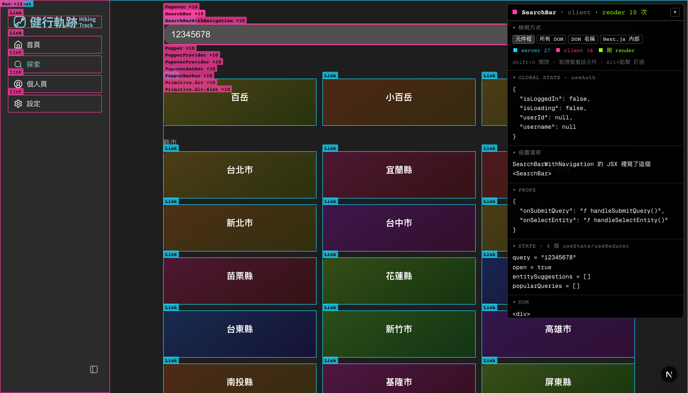

# 健行軌跡 · 前端

用 Next.js 寫的健行紀錄工具。上傳 GPX、把軌跡畫在地圖上、用圖表看累積成果。

這是第二版前端。第一版是 Vite + Sass（在 `hiking_map_frontend/`，已停用），改寫的動機是想要 SSR、以及一套能撐得住的元件與樣式規範。

## 開發

```bash
pnpm install
pnpm dev          # http://localhost:4219
```

後端要另外起（見專案根目錄的 README），預設連 `http://localhost:3001`，可用 `.env.local` 的 `NEXT_PUBLIC_API_BASE_URL` 覆寫。

其他指令：

```bash
pnpm build        # production build
pnpm lint
pnpm storybook    # http://localhost:6006
pnpm generate:api # 從後端 Swagger 重新生成 API client
```

## 目錄

```
src/
├── app/[locale]/     頁面（App Router，路由帶語系前綴）
├── components/       跨頁面共用元件，一個資料夾一個元件
├── features/         特定領域的元件組合
├── lib/
│   ├── api/
│   │   ├── generated/  Swagger 自動生成，不要手改
│   │   └── adapters/   snake_case ↔ camelCase 與型別轉換
│   └── apiClient.ts    對外只從這裡取用 API
├── styles/           palette.css（原始色票）+ tokens.css（語意化 token）
└── testing/mocks/    Storybook 與測試用假資料
```

## 幾個約定

**API 不要手寫。** 後端改完端點就跑 `pnpm generate:api`，`lib/api/generated/` 整包重生。頁面一律從 `lib/apiClient` 取用，中間隔著 `adapters/` 這層——後端回傳 snake_case，前端用 camelCase，轉換只發生在那裡。

**顏色不要寫死。** `palette.css` 放原始色票，`tokens.css` 把它們映射成語意化的名字（`--color-panel`、`--color-accent`…），元件只用後者。深淺主題靠 `.light` 覆寫同一組 token，所以換主題不需要改任何元件。品牌色目前是單一值，深淺共用。

**版面交給 `PageLayout`。** 標題、副標、返回連結、外層間距都由它決定，頁面只負責內容。最大寬度統一在 `app/[locale]/layout.tsx`。

**雙語。** `zh-TW` 與 `en`，文案放 `messages/`。數字與日期用 ICU 格式（例如距離是 `{distance, number, ::.00}`），不要在元件裡自己 `toFixed`。

## 現況

定位收斂為**個人紀錄工具**——保存自己的健行紀錄、看圖表，不做社群。追蹤功能與即時 GPS 錄製都已移除，紀錄來源改為上傳 GPX。

進行中：GPX 上傳與編輯（裁掉忘記關錄製的路段、把多段軌跡合併）。

## Debug 疊層

開發時按 `Shift+D`，把畫面上的 React 元件直接畫出來。



- **元件框與名稱**，藍色是 server component、粉紅是 client component
- **props、state、全域狀態**，state 會顯示原始碼裡的變數名稱（`query = "12345678"`）
- **render 次數**，剛重畫過的元件會亮綠色，用來確認誰因為什麼而重新渲染
- **由誰渲染**，也就是這個元件是寫在誰的 JSX 裡
- 滑鼠移到標籤上切換元件，`Alt` + 點擊釘選

實作在 `src/lib/debug/`，資料來自 React 的 fiber tree 與 commit 掛鉤，
都不是公開 API，所以只在開發環境載入，讀取全程 try/catch。
